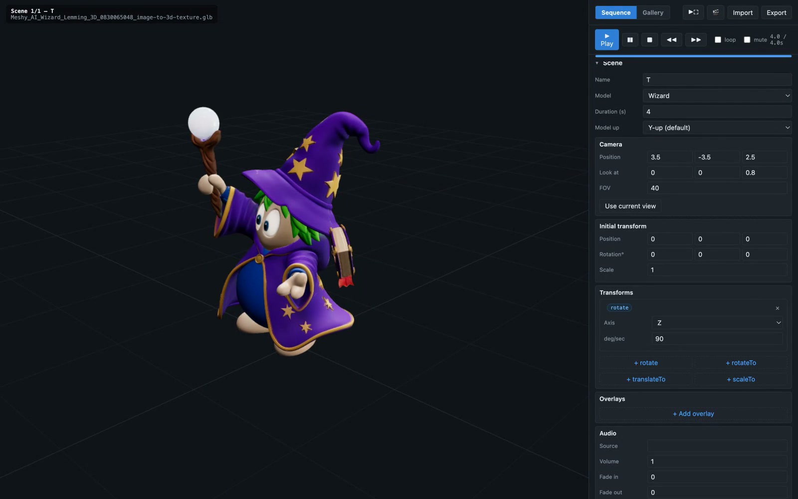

# USDZ Sequence Viewer

A 3D model viewer with a scripting engine for sequencing scenes of `.glb` / `.usdz` models. Rotate, translate, and scale models; overlay text with fades; sequence multiple scenes with camera transitions; add audio narration; record the whole thing to WebM/MP4.

Runs either as a web app (via a tiny local HTTP server) or as a standalone macOS / Windows / Linux desktop app (Electron).


### 📖 [Read the User Guide](docs/user-guide.md) &nbsp; · &nbsp; 📺 [Watch the 2-min Tutorial](https://geekychris.github.io/usdz-sequence-viewer/)

[](https://geekychris.github.io/usdz-sequence-viewer/)

> Click the thumbnail above to play the narrated walkthrough in your browser (via GitHub Pages), or [download the MP4](https://geekychris.github.io/usdz-sequence-viewer/tutorial.mp4) to play locally.

## Quick start

### Prerequisites
- **Node.js 18+** (only needed for the Electron desktop app; the web version needs only Python 3, which ships with macOS)
- **Blender 4.x** (only if you want to convert `.usdz` files with USDC-binary contents to `.glb` — see [Model conversion](#model-conversion))

### Web app (fastest)
```bash
# From the project root
./serve.sh           # starts a local server on http://localhost:8765/
# Then open http://localhost:8765/ in Chrome or Edge
```

Note the `-8000` in the printout is now `8765` — override with `PORT=xxxx ./serve.sh` if you like.

### Desktop app (self-contained)
```bash
npm install          # first time only — installs three.js + Electron (~200 MB)
npm start            # launches the app in an Electron window
```

### Build distributables
```bash
npm run build:mac    # → dist/*.dmg + dist/*.zip
npm run build:win    # → dist/*.exe (requires Wine on Mac, or run on Windows)
npm run build:linux  # → dist/*.AppImage + dist/*.tar.gz
```

## What's in the box
- `index.html` / `main.js` / `styles.css` — the viewer + editor UI (single-page ES module app)
- `models/` — sample lemming models (`.glb`, converted from Meshy AI's `.usdz` originals)
- `audio/` — sample narrations, generated locally with [Kokoro TTS](https://github.com/hexgrad/kokoro)
- `demo.json` — minimal 9-scene starter script
- `showcase.json` — a fuller 10-scene showcase with per-scene camera angles, transforms, overlays, and audio
- `manifest.json` — list of models the editor's model dropdown surfaces
- `electron/main.js` — Electron main-process entry point
- `tools/` — utility scripts (Blender USDZ→GLB conversion, Playwright doc capture, headless recording tests)
- `docs/user-guide.md` — full user guide

## Text-to-speech (optional)

The bundled showcase narrations (`audio/*.mp3`) were generated with **[Kokoro TTS](https://github.com/geekychris/kokoro_runtime)** — a small local Rust server that runs the [Kokoro-82M](https://huggingface.co/hexgrad/Kokoro-82M) speech model via ONNX. Everything runs offline once installed (~340 MB model download).

### Install (one-liner)
```bash
./scripts/install-tts.sh
```

This delegates to Kokoro's own installer, which clones the runtime into `~/.kokoro/src`, downloads the model, builds `kokoro-server` (Rust, ~2–5 min the first time), and starts it on `127.0.0.1:8770`.

If you're missing prereqs (`rust`, `espeak-ng`, `jq`), allow it to install them:
```bash
KOKORO_AUTO_INSTALL=1 ./scripts/install-tts.sh
```

To check out the runtime as a sibling directory next to this project (useful if you want to hack on it):
```bash
./scripts/install-tts.sh --sibling      # → ../kokoro_runtime/
```

### Regenerate the demo narrations
Once the server is up:
```bash
./scripts/regen-narration.sh
```

Rewrites `audio/intro.mp3`, `audio/superhero.mp3`, … the 10 files referenced by `showcase.json`.

Change the voice with `VOICE=bm_george ./scripts/regen-narration.sh` — pick from `curl -s http://127.0.0.1:8770/voices` (54 voices available).

### Custom narration for your own scenes
Point `scene.audio.src` at any `.mp3` / `.m4a` / `.wav` you produce. To generate one via the running Kokoro server:
```bash
curl -X POST http://127.0.0.1:8770/mcp \
  -H 'Content-Type: application/json' \
  -d '{"jsonrpc":"2.0","method":"tools/call","id":1,
       "params":{"name":"speak","arguments":{
         "text":"Welcome to the show.","voice":"af_bella","format":"mp3",
         "output_path":"'"$(pwd)"'/audio/welcome.mp3"}}}'
```

## Model conversion
Three.js's built-in `USDZLoader` only reads **ASCII USDA** files inside a `.usdz` container. Files from AR / iOS tools (including Meshy AI) contain **binary USDC** which the loader silently ignores → invisible model. Convert them to `.glb` with Blender:

```bash
# Single file
/Applications/Blender.app/Contents/MacOS/Blender --background --python tools/usdz_to_glb.py -- \
  models/MyModel.usdz models/MyModel.glb

# All .usdz in models/
for f in models/*.usdz; do
  /Applications/Blender.app/Contents/MacOS/Blender --background --python tools/usdz_to_glb.py -- \
    "$f" "${f%.usdz}.glb"
done
```

The GLB files are then referenced from your scripts. The viewer routes `.glb` / `.gltf` files to `GLTFLoader` and `.usdz` / `.usda` files to `USDZLoader` automatically.

## Recording
The **🎬** button records the whole script to WebM (default) or MP4. See [User Guide → Recording](docs/user-guide.md#recording-a-video) for details.

## Documentation
- [**User Guide**](docs/user-guide.md) — creating projects, adding models, all the editor tools, sequencing tips
- [**Script format**](docs/user-guide.md#script-format-reference) — full JSON schema

## Development
The app is a plain ES-module web page. No build step needed for dev — edit files and reload. `npm install` is only necessary to run under Electron and package a distributable.

Screenshots in this README and the user guide are auto-captured by `tools/capture_docs.mjs` (Playwright).

Headless recording smoke test: `tools/test_showcase.mjs` — records the whole showcase and dumps the WebM to `.test-out/`.

## Repo notes
- `.usdz` originals are gitignored (they duplicate the `.glb` converts at ~40 MB each — 383 MB saved). Re-generate with `tools/usdz_to_glb.py` if you need them back.
- The `.glb` models are ~385 MB total. If pushing to GitHub, consider [Git LFS](https://git-lfs.com/) to keep the working tree lean:
  ```bash
  git lfs install
  git lfs track "models/*.glb"
  git lfs migrate import --include="models/*.glb"
  ```
- One model (`Rock_Star`) is 66 MB; GitHub warns above 50 MB but doesn't block until 100 MB.

## License
Personal project. Model assets from [Meshy AI](https://www.meshy.ai/). Fonts and code your own.
