# User Guide

The USDZ Sequence Viewer is a small 3D presentation tool. You load models, arrange them into scenes, script transforms + camera angles + text + audio, and either play the result live or record it to a video file.

📺 **[Watch the 2-minute video tutorial](tutorial.mp4)** — narrated walkthrough of building a project from scratch.

This guide walks through every part of the app.

- [The layout](#the-layout)
- [Modes](#modes)
- [Creating a project](#creating-a-project)
- [Adding models](#adding-models)
- [Building a sequence](#building-a-sequence)
- [The scene editor in detail](#the-scene-editor-in-detail)
  - [Model + Duration](#model--duration)
  - [Camera](#camera)
  - [Initial transform](#initial-transform)
  - [Transforms (the animation)](#transforms-the-animation)
  - [Overlays (text on screen)](#overlays-text-on-screen)
  - [Audio](#audio)
- [Playing the sequence](#playing-the-sequence)
- [Gallery + Detail modes](#gallery--detail-modes)
- [Recording a video](#recording-a-video)
- [Fullscreen presentation](#fullscreen-presentation)
- [Tips for great sequences](#tips-for-great-sequences)
- [Script format reference](#script-format-reference)

---

## The layout


Two panels:
- **Left**: the 3D viewer. Live 3D render, plus HUD text (top-left) and a "back" button (top-right) when relevant.
- **Right**: the editor. Contains the mode tabs, transport bar, scene list, per-scene form, and the raw-JSON view.

The three panels in the editor are chosen by the **mode tabs** at the top:

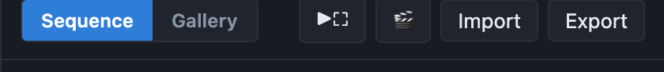

- **Sequence** — script authoring mode (this is where 90% of the work happens)
- **Gallery** — visual "main menu" grid of every model in your manifest
- **Detail** — automatically entered when you click a model in Gallery

---

## Modes

| Mode | What it's for |
|---|---|
| **Sequence** | Build, edit, and play scripted animations. All the authoring tools live here. |
| **Gallery** | Browse every model in your manifest at once on a 3D grid. |
| **Detail** | Focus on a single model with a pre-programmed rotation and slow camera orbit. Perfect for quickly checking a new model. |

Switching between modes is instant — click a tab in the header. Detail mode has a **← Back** button in the viewer to return to Gallery.

---

## Creating a project

The simplest "project" is a JSON file. There's no create-project workflow — you have three ways to start a new script:

### Option A — Edit the existing demo
1. Launch the app.
2. It loads `demo.json` on first run (auto-saved to `localStorage` after that).
3. Edit scenes, save via **Export** to download your script.

### Option B — Import a script
Click **Import** in the toolbar and pick a `.json` file. That replaces the current script.

### Option C — Start from a blank
Click **Import** and pick an empty JSON file, or paste `{}` into the Raw JSON panel and click **Apply JSON**. Then add scenes with **+ Add scene**.

### Save / load
- **Autosave**: any edit is saved to your browser's `localStorage` (key `usdz-viewer.script.v1`), so a reload resumes where you left off.
- **Export**: downloads the script as `<name>.json`.
- **Import**: replaces the current script from a file.

To fully reset to the bundled demo, clear the `usdz-viewer.script.v1` key in DevTools → Application → Local Storage.

---

## Adding models

The viewer supports two model formats:

| Format | Loader | Notes |
|---|---|---|
| `.glb` / `.gltf` | Three.js `GLTFLoader` | **Recommended.** Robust, well-tested, PBR materials, animations. |
| `.usdz` / `.usda` | Three.js `USDZLoader` | Only ASCII USDA is supported. Binary USDC (what most `.usdz` files actually contain) is silently ignored → invisible model. Convert to GLB via the [Blender helper](../README.md#model-conversion). |

### Put files in `models/` (or anywhere)
The viewer resolves model paths relative to `index.html`. Convention: drop them in `models/`. But any relative path works — `assets/props/table.glb` is fine.

### The manifest — surfacing models in the dropdown
`manifest.json` is a friendly-label list the editor shows in the **Model** dropdown:

```json
{
  "models": [
    { "label": "Wizard",  "path": "models/Wizard.glb" },
    { "label": "Chef",    "path": "models/Chef.glb" },
    { "label": "Custom",  "path": "assets/custom.glb" }
  ]
}
```

You can also type a **custom path** in the model field for anything not in the manifest.

### Model orientation
GLB files are usually Y-up (Y is vertical). The viewer sets the world to Z-up (matching USD convention), so it applies a `-90°` rotation around X on load. If your model comes in on its side, flip **Model up** in the scene form from `Y-up` to `Z-up`.

### Model size
The viewer auto-fits every model to ~1.8 world units tall, and centers it on X/Y with its base on Z=0. Camera positions in the demo assume this convention. Turn off auto-fit by setting `"autoFit": false` in a scene (only via Raw JSON).

### Backgrounds and floors

Two script-level (or per-scene) settings let you replace the default dark background and floor grid with images:

| Field | Value |
|---|---|
| `background` | CSS color (`#101317`) OR a path to an image (`models/background.jpg`). Auto-detected by file extension. |
| `floor` | Path to an image, e.g. `models/floor.jpg`. Textured across a 20×20 unit ground plane; the debug grid is hidden when set. |

Example (script-level defaults):
```json
{
  "name": "My Animation",
  "background": "models/background.jpg",
  "floor": "models/floor.jpg",
  "scenes": [ ... ]
}
```

Per-scene override (a title scene with plain dark background, then the rest of the scenes use the image):
```json
"scenes": [
  { "name": "Title", "background": "#000", "floor": "", ... },
  { "name": "Scene 2", ... }
]
```

- Set `background: ""` (empty string) at scene level to force the default dark colour and override an image inherited from the script.
- Set `floor: ""` at scene level to remove the floor plane and restore the grid.
- Any HTML-supported image format works (`.jpg`, `.png`, `.webp`).
- Both are captured in video recordings — no need for separate compositing.

---

## Building a sequence

A **script** is a list of **scenes**. Each scene shows one model for a fixed duration, with a camera angle, some transforms, optional overlays, and optional audio.

Here's the sequence editor with the demo showcase loaded:

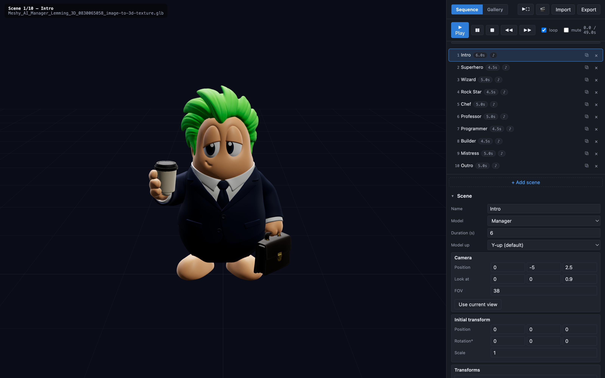

Steps to add a new scene:
1. Click **+ Add scene** below the list. A new scene is appended (inheriting the previous scene's camera).
2. Click the new scene in the list to select it.
3. Fill in the [scene form](#the-scene-editor-in-detail).
4. Press **▶ Play** to preview.

### Scene list

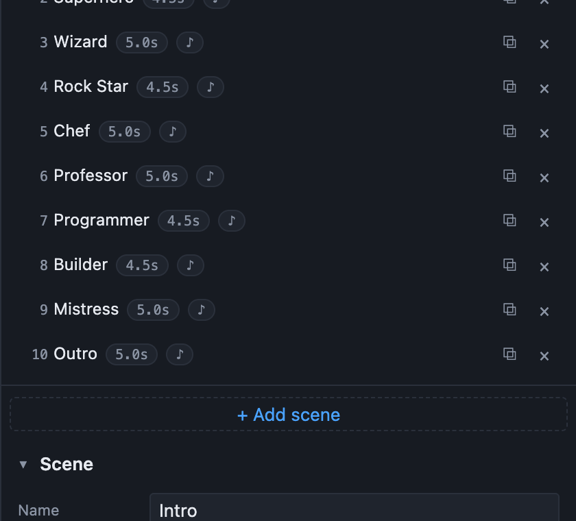

- **Click** a row to select it (opens its form below).
- **Drag** a row to reorder. A blue line shows the drop position.
- **⧉** duplicates the scene (right after the original).
- **×** deletes the scene.
- The badge shows the scene's duration; a **♪** icon means the scene has audio.
- The currently-playing scene is highlighted in green when Play is running.

### Drag-reorder

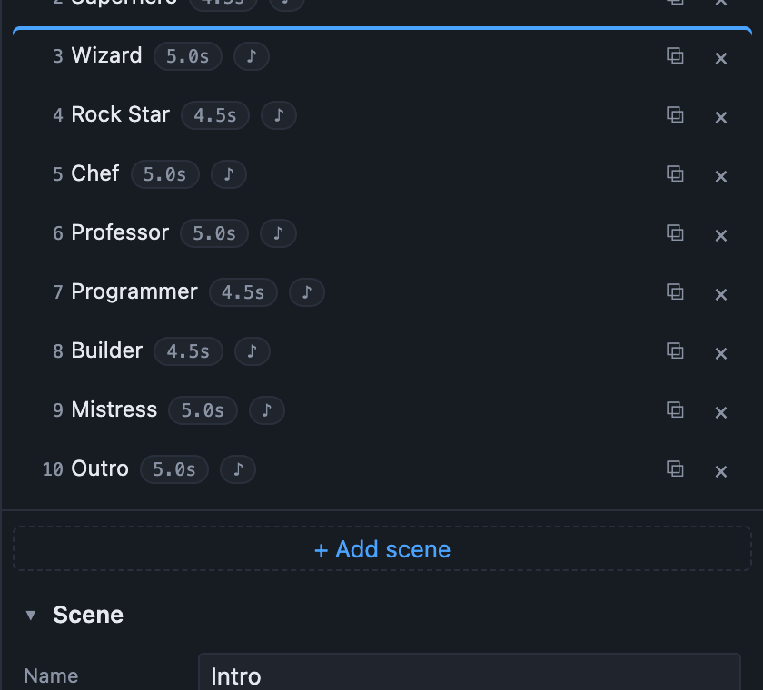

The dragged row goes translucent; a blue bar on the target row indicates where it'll drop.

---

## The scene editor in detail

Selecting a scene opens the form. Here it is at the top:

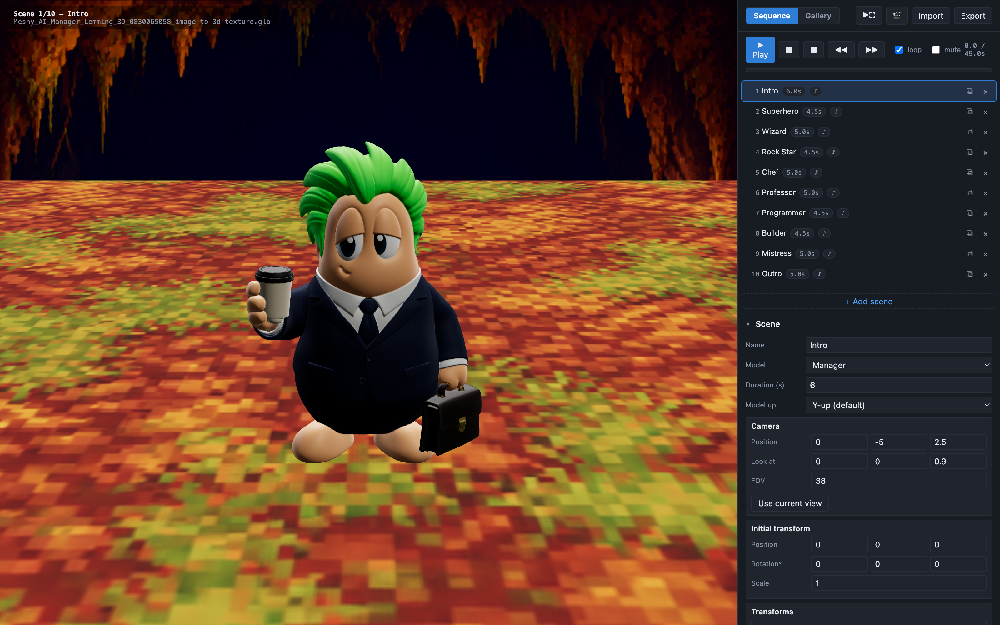

### Model + Duration
- **Name** — cosmetic. Shows in the scene list and HUD; also becomes the default overlay if you like.
- **Model** — the dropdown lists everything in `manifest.json`. Pick "custom path…" to type a relative path.
- **Duration (s)** — how long this scene plays before advancing to the next.
- **Model up** — flip if the model comes in lying on its side. See [Model orientation](#model-orientation).

### Camera
- **Position** `[x, y, z]` — where the camera is placed, in world units. Z is up.
- **Look at** `[x, y, z]` — where the camera points.
- **FOV** — field of view in degrees. Lower = more telephoto; higher = more fisheye.
- **Use current view** — a handy shortcut. Freely orbit the viewer with mouse drag (OrbitControls), then click this button to snap the current angle into the scene's camera. Way faster than typing coordinates.

Camera transitions between scenes are automatically **eased** — the camera glides from the previous scene's angle to the new one over ~1.1 seconds. Configure the ease speed at the top of the JSON:
```json
"cameraTransition": { "duration": 0.8, "ease": "easeInOut" }
```

### Initial transform
Applied once at the start of the scene. Useful for offsetting the model:
- **Position** — offsets the model from the origin.
- **Rotation°** — starting rotation, in degrees (Euler XYZ).
- **Scale** — uniform scale factor. `1` = auto-fitted size.

### Transforms (the animation)


This is where the animation lives. Each transform is one entry in the list; they all run in parallel during the scene. Add new ones with the four buttons at the bottom (`+ rotate`, `+ rotateTo`, `+ translateTo`, `+ scaleTo`).

| Type | Behavior | Fields |
|---|---|---|
| **rotate** | Continuous rotation — the model spins forever at a fixed rate. | `axis` (x/y/z), `deg/sec` |
| **rotateTo** | Animated rotation from A° to B° over a fixed time window. | `axis`, `from°`, `to°`, `start (s)`, `dur (s)`, `ease` |
| **translateTo** | Animated position change (move-to). Great for hops, slides. | `to [x,y,z]`, `start`, `dur`, `ease`, optional `from` |
| **scaleTo** | Animated scale change (pulse, grow, shrink). | `to`, `start`, `dur`, `ease`, optional `from` |

**Ease** options: `linear`, `easeIn`, `easeOut`, `easeInOut`. `easeInOut` gives the most natural motion.

**Combining transforms** — you can stack them. Common patterns:
- **Continuous spin + one-time flourish**: a `rotate` (60°/s Z) plus a `scaleTo` pulse at t=1s.
- **Hop**: two `translateTo` back-to-back — up over 0.35s, then down over 0.35s.
- **Sequenced rotations**: a `rotateTo Y 0→90 at 1s`, then another `rotateTo Y 90→180 at 2s`.

### Overlays (text on screen)


Overlays are text labels rendered into the 3D scene (so they're captured in video recordings too). Add with **+ Add overlay**.

Fields:
- **Text** — the string to display. Emoji work.
- **Position** — `Top`, `Center`, or `Bottom` of the viewer.
- **Start (s)** — when in the scene the overlay begins.
- **Fade in** — how long the fade-in animation takes.
- **Hold** — how long text stays fully visible.
- **Fade out** — how long the fade-out takes.
- **Color** — CSS color (e.g. `#ffd166`, `white`, `rgba(...)`).
- **Font size** — pixels.

The **timeline** for one overlay is: `wait for start → fade in (fadeIn) → hold (hold) → fade out (fadeOut) → gone`.

Multiple overlays per scene are supported. Stagger their `start` times to create a mini-sequence within a scene (e.g. big title at t=0.4s, subtitle at t=2s).

### Audio

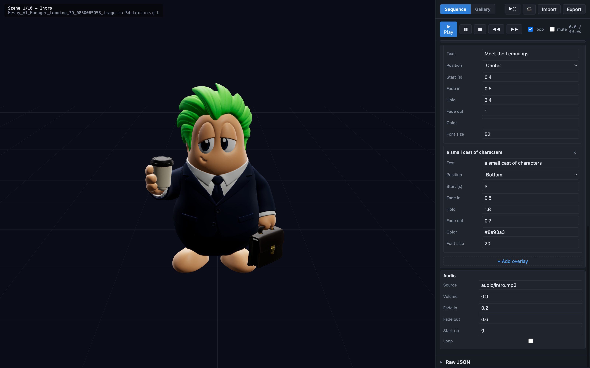

Each scene can play a single audio file (MP3 / M4A / OGG / WAV — anything `HTMLAudioElement` supports).

- **Source** — relative path (e.g. `audio/wizard.mp3`).
- **Volume** — 0.0 – 1.0.
- **Fade in** — seconds to ramp up from 0 to full volume at the start of the audio.
- **Fade out** — seconds to ramp down to 0 near the end of the scene.
- **Start (s)** — when in the scene to start playing the audio (delay from scene start).
- **Loop** — if the audio is shorter than the scene, replay it.

**Global mute** — the transport bar has a **mute** checkbox that overrides all scene audio without editing the script.

**Producing narration** — the bundled `audio/*.mp3` files were made with the [Kokoro TTS](https://github.com/geekychris/kokoro_runtime) local speech server (voice `af_bella`). Two helpers live in `scripts/`:

- `./scripts/install-tts.sh` — installs and starts the Kokoro runtime (delegates to its upstream installer). Add `KOKORO_AUTO_INSTALL=1` to allow it to `brew`/`apt` the prereqs, or `--sibling` to clone `../kokoro_runtime` next to this project instead of the default `~/.kokoro/src`.
- `./scripts/regen-narration.sh` — regenerates the 10 showcase narrations against a running server (change voice with `VOICE=bm_george`).

To generate one custom clip from any text:
```bash
curl -X POST http://127.0.0.1:8770/mcp -H 'Content-Type: application/json' -d '{
  "jsonrpc":"2.0","method":"tools/call","id":1,
  "params":{"name":"speak","arguments":{
    "text":"Once upon a time…",
    "voice":"af_bella",
    "format":"mp3",
    "output_path":"'"$(pwd)"'/audio/once.mp3"
  }}
}'
```

Then reference it from a scene:
```json
"audio": { "src": "audio/once.mp3", "volume": 0.9, "fadeIn": 0.2, "fadeOut": 0.5 }
```

Every Kokoro voice preserves punctuation-driven pacing — periods slow, ellipses pause, question marks lift the pitch. Write narration the way you'd read it aloud.

### Raw JSON

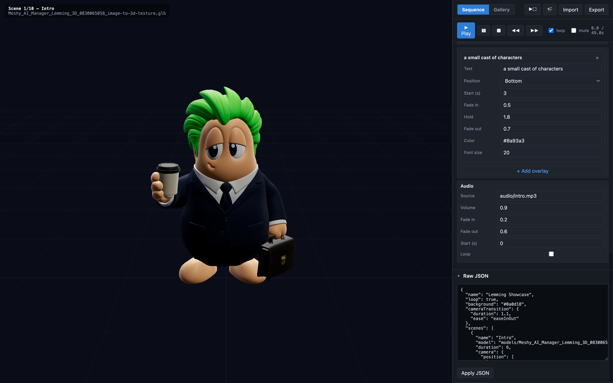

Expand **Raw JSON** at the bottom of the editor to see (and edit) the full script as text. Click **Apply JSON** to commit changes. Useful for:
- Bulk find/replace across scenes.
- Editing fields the form doesn't expose (`autoFit`, `targetHeight`, `background`, `cameraTransition`, `translate` continuous velocity).
- Copy/paste sharing.

---

## Playing the sequence

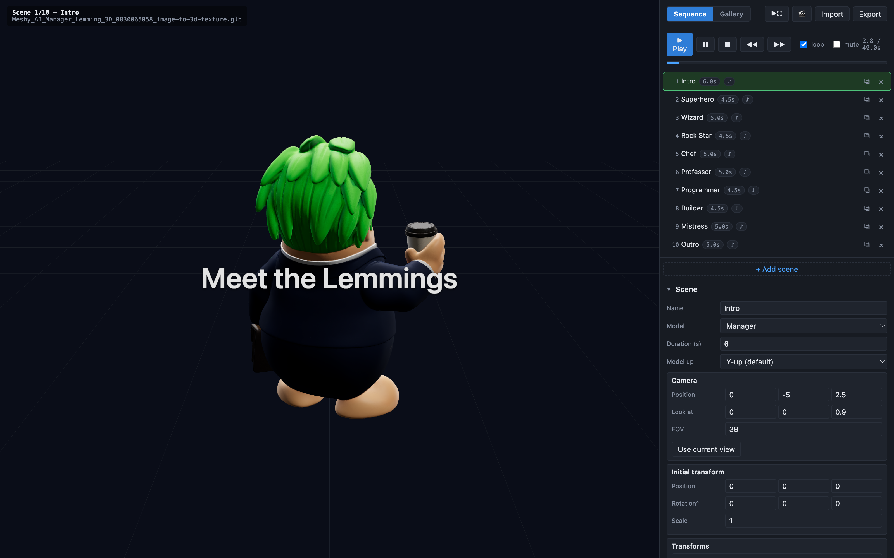

Transport bar:

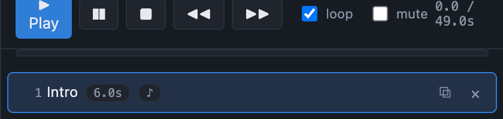

| Control | What it does |
|---|---|
| **▶ Play** | Start playback from the currently selected scene (or scene 1 if you just stopped). |
| **❚❚** Pause | Freeze playback in place. Play again to resume. |
| **■** Stop | Return to scene 1, sceneTime=0. |
| **◀◀** / **▶▶** | Jump to previous / next scene. Uses the camera-transition tween. |
| **loop** | On the last scene, restart at scene 1 instead of stopping. |
| **mute** | Silence all scene audio without editing the script. |
| Time readout | `elapsed / total s`. |
| Timeline bar | Total-playback progress across all scenes. |

**Keyboard**: press **Space** anywhere outside a text input to toggle play/pause. **Esc** exits Detail or Fullscreen.

---

## Gallery + Detail modes

Click the **Gallery** tab in the header to see every model in your manifest on a 3D grid:

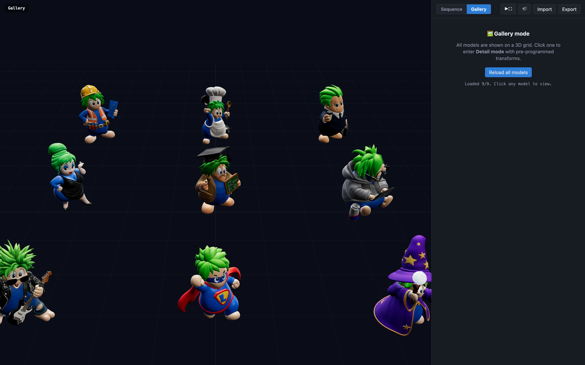

- All models load in parallel; a "Loaded N/9" status appears in the panel on the right.
- Hover a model — a floating label shows its friendly name and the cursor becomes a pointer.
- Click a model → **Detail mode** with pre-programmed transforms:

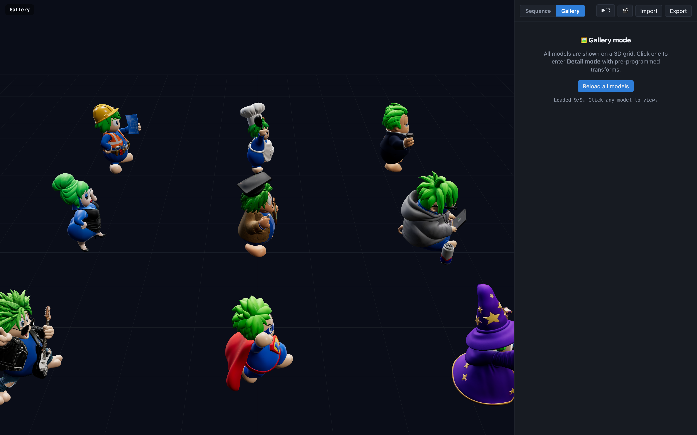

Detail mode plays:
- A dolly-in camera transition from the Gallery overview.
- Continuous Z-axis rotation (~30°/s) on the model.
- The model's name faded in as a bottom overlay.
- A slow camera orbit around the model (toggle with the checkbox in the Detail panel).

Return to Gallery with the **← Back** button in the viewer, or press **Esc**.

Great for previewing a new asset before wiring it into a scene.

---

## Recording a video

Click **🎬** in the header to open the recording dialog:

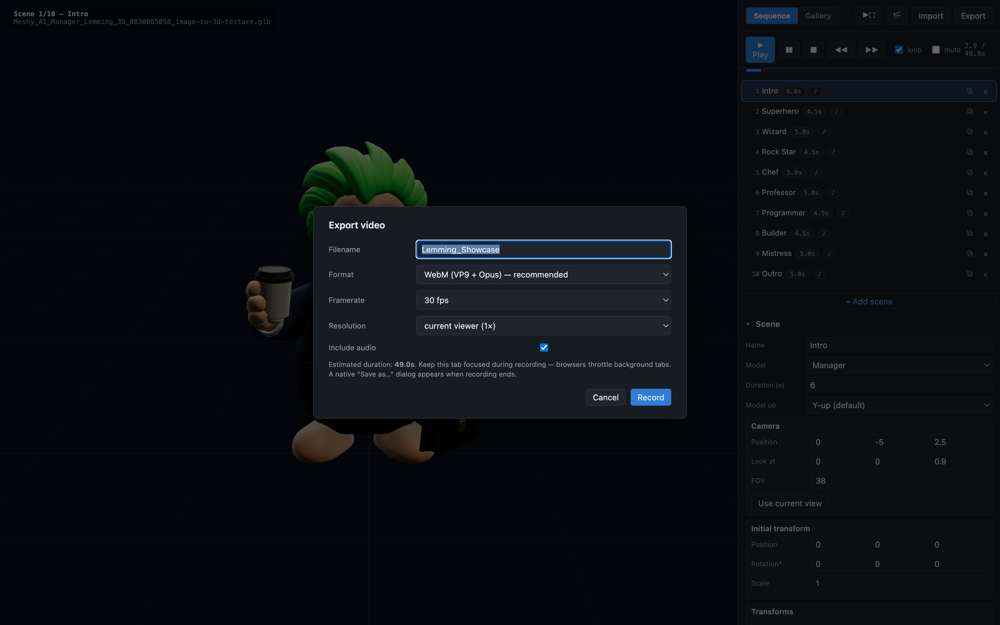

Settings:
- **Filename** — pre-filled from the script name. Extension is added automatically.
- **Format** — **WebM (VP9 + Opus)** is default and most reliable. **MP4 (H.264)** works on Chrome but has caveats — see below.
- **Framerate** — 24 (cinematic), 30 (default), or 60 (smooth).
- **Resolution** — the recorder always renders at 1× CSS pixels to keep the codec happy; this setting is a placeholder for future upscaling.
- **Include audio** — captures scene audio + a silent oscillator to keep the encoder pipeline unblocked.

When you press **Record**:
1. The app **preloads all models** used in the script (avoids mid-recording stalls).
2. Playback rewinds to scene 1 and starts.
3. The recorder taps `renderer.domElement.captureStream(fps)` once the render loop is warm.
4. The Recording panel appears in the top-right of the viewer with **frames** and **time / total** counters.

**Keep the tab focused during recording.** Chrome throttles background tabs, which will freeze the recording on a single frame. This is why the tab shouldn't be minimized or covered.

When playback reaches the last scene:
1. The recorder stops.
2. On Chrome / Edge, a **native "Save as…" dialog** opens — pick your folder there.
3. On Firefox / Safari, the file downloads to your browser's Downloads folder.
4. A green banner in the top-right shows `✓ Saved: filename.webm (X.X MB)`. It's **sticky** — click the ✕ to dismiss.

### WebM → MP4 conversion
WebM plays in Chrome, Firefox, VLC, and most modern players. QuickTime does not play WebM. Convert with:
```bash
brew install ffmpeg
ffmpeg -i input.webm -c:v libx264 -c:a aac output.mp4
```

### Why Retina caused problems earlier
On a Retina display the WebGL canvas is 2× CSS pixels (e.g. 2210×2030). At 30 fps that overwhelms Chrome's software VP9 encoder. The recorder now temporarily drops to `pixelRatio: 1` during capture and restores it after, keeping recording resolution codec-safe (~1105×1015).

---

## Fullscreen presentation

Click **▶⛶** in the header to enter Fullscreen Play:

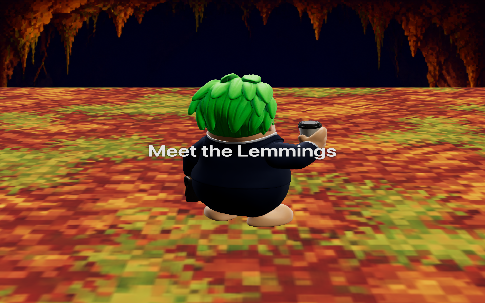

The editor panel disappears, the viewer takes the whole window, and playback starts from scene 1. Great for showing off the sequence on a projector or big screen.

- **Esc** or the discreet **✕ Exit** button (top-right, dims when idle) returns to the editor.
- If the script has `loop: false`, playback exits Fullscreen on completion.
- Uses the browser's Fullscreen API (window Chrome bars disappear too).

---

## Tips for great sequences

**Keep durations 4–6 seconds per scene.** Under 3s feels choppy; over 8s risks getting boring unless the model is doing a lot.

**Vary camera angles between scenes.** The ease-in camera transition is the visual glue between shots. If every scene has the same camera, the transitions are invisible and the piece feels static.

**Match camera intensity to model action.**
- Static model → dynamic camera (dolly, orbit).
- Rotating model → simple camera (front 3/4).
- Both moving → risk of motion sickness — pick one.

**Stagger overlay text.** A "big title" at `start: 0.4` + a subtitle at `start: 2.0` reads as a mini-story within a scene, much better than two overlays fighting for attention at t=0.

**Colour-code characters.** In `showcase.json` each lemming's name overlay uses a different color that hints at their role (wizard purple, professor blue, chef orange). Small touch, big personality.

**Use continuous `rotate` for the "hero" motion, `scaleTo` for accents.** A Z-axis spin at 60–90°/s is the workhorse. A one-time `scaleTo` pulse at t=1s is a great "there!" moment.

**Recording is real-time.** A 60s script takes 60s to record. Test playback first — if a scene isn't quite right, fix it before recording.

**Audio narration timing.** Kokoro TTS at speed 1.0 is roughly ~4 characters/second. A 4-second scene fits ~16 characters of narration. Longer narrations should span multiple scenes (chain them with `start` offsets).

---

## Script format reference

Full JSON schema of a script:

```jsonc
{
  "name": "My Animation",              // shown in HUD, becomes default filename
  "loop": true,                        // restart at scene 1 after the last scene
  "background": "#0a0d18",             // color OR image path ("models/bg.jpg")
  "floor": "models/floor.jpg",         // optional floor image (hides the grid)
  "cameraTransition": {                // default ease for camera between scenes
    "duration": 0.8,
    "ease": "easeInOut"                // "linear" | "easeIn" | "easeOut" | "easeInOut"
  },
  "scenes": [
    {
      "name": "Optional scene name",
      "model": "models/Wizard.glb",    // .glb / .gltf / .usdz / .usda
      "duration": 5.0,                 // seconds
      "modelUp": "y",                  // "y" (default) or "z"
      "autoFit": true,                 // scale model to ~1.8u height (default true)
      "targetHeight": 1.8,             // override auto-fit target

      "camera": {
        "position": [3, -3, 2],
        "lookAt":  [0, 0, 0.9],
        "fov": 40
      },

      "initial": {
        "position": [0, 0, 0],         // offset from origin
        "rotation": [0, 0, 0],         // Euler degrees
        "scale": 1                     // number or [x,y,z]
      },

      "transforms": [
        { "type": "rotate", "axis": "z", "degPerSec": 90 },
        {
          "type": "rotateTo",
          "axis": "y",
          "from": 0, "degrees": 180,
          "start": 1.0, "duration": 1.5,
          "ease": "easeInOut"
        },
        {
          "type": "translateTo",
          "from": [0,0,0], "to": [0,0,0.4],
          "start": 0.8, "duration": 0.35,
          "ease": "easeOut"
        },
        {
          "type": "scaleTo",
          "from": 1.0, "to": 1.15,
          "start": 0.3, "duration": 0.4,
          "ease": "easeOut"
        },
        {
          "type": "translate",                // continuous velocity
          "velocity": [0, 0.5, 0]             // units per second
        }
      ],

      "overlays": [
        {
          "text": "The Wizard",
          "position": "bottom",               // "top" | "center" | "bottom"
          "start": 0.4,
          "fadeIn": 0.7, "hold": 3.2, "fadeOut": 0.7,
          "fontSize": 38,
          "color": "#c084fc"
        }
      ],

      "audio": {
        "src": "audio/wizard.mp3",
        "volume": 0.9,                        // 0 – 1
        "fadeIn": 0.15, "fadeOut": 0.5,
        "start": 0.3,                         // delay from scene start
        "loop": false
      }
    }
  ]
}
```

All fields except `model` are optional. A minimal scene:
```json
{ "model": "models/hero.glb", "duration": 3 }
```

That works — spins nothing, uses last camera, no text, no audio. Then build up from there.
